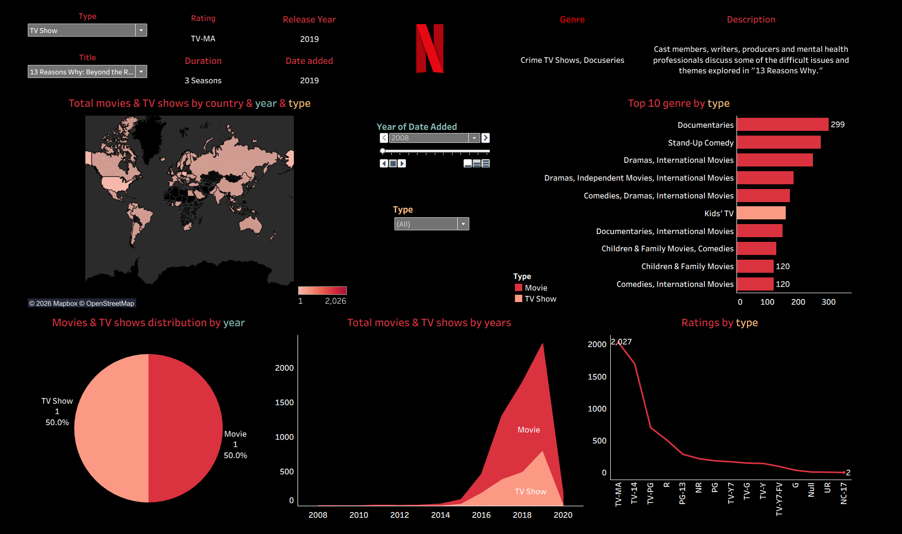

# 🎬 Netflix Movies & TV Shows Dashboard (Tableau)

  

An interactive **Tableau Public dashboard** analyzing Netflix Movies and TV Shows
across **time, geography, genre, rating, and content type**.

🔗 **Live Dashboard (Tableau Public)**  
👉 https://public.tableau.com/app/profile/ruyigai/viz/NetflixdataanalysismoviesTVshows/Dashboard1

---

## 📌 Project Overview

This Tableau dashboard explores Netflix’s content library through **five core visualizations** and two synchronized interactive controls:
- A **Year of Date Added** control that drives year-by-year exploration
- A **Type** control (Movie / TV Show / All) that filters multiple views together

In addition, a top panel allows users to select a specific **Type** and **Title** to display detailed metadata such as rating, duration, release year, and description.

---

## 🧩 Dashboard Structure & Interactions (5 Visuals)

### 1) 🌍 Global Distribution Map (Movies & TV Shows by Country)
- Shows Netflix titles distribution across countries.
- **Linked controls:**
  - **Year of Date Added** (dynamic by year)
  - **Type** filter: **Movie / TV Show / All**
- This view is designed to help users compare geographic patterns across years and content types.

### 2) 🥧 Overall Share: Movies vs TV Shows (Year-aware)
- Displays the overall proportion of **Movies vs TV Shows**.
- **Linked control:**
  - **Year of Date Added** (dynamic by year)
- **Important:** This pie chart updates **together with the map** when the year changes.

### 3) 📈 Total Movies & TV Shows by Years (Overall Trend)
- Shows the overall trend of total Netflix titles over time (yearly).
- Helps identify growth periods and major changes in Netflix content expansion.

### 4) 🎭 Top 10 Genres by Type
- Ranks the **Top 10 genres** for the selected content type.
- **Linked control:**
  - **Type** filter: **Movie / TV Show / All**
- Supports quick comparison of dominant genres by content type.

### 5) 🏷 Ratings by Type
- Shows rating distribution (e.g., TV-MA, TV-14, PG-13, etc.).
- **Linked control:**
  - **Type** filter: **Movie / TV Show / All**
- Helps compare audience targeting differences between Movies and TV Shows.

---

## 🎛️ Filters & Linking Logic (How Everything Updates)

### A) Year-driven linkage
- **Year of Date Added** controls **two views together**:
  - **(1) Map**
  - **(2) Movies vs TV Shows share (Pie Chart)**

### B) Type-driven linkage
- **Type (Movie / TV Show / All)** controls **three views together**:
  - **(1) Map**
  - **(4) Top 10 Genres**
  - **(5) Ratings by Type**

### C) Top detail panel (Type + Title)
At the top of the dashboard, users can select:
- **Type**
- **Title**

Once a specific title is selected, the dashboard displays detailed metadata:
- **Rating**
- **Duration**
- **Release Year**
- **Date Added**
- **Genre**
- **Description**

This section supports “item-level” exploration in addition to the aggregated charts.

---

## 🗂 Dataset

- **File:** `data/netflix_titles.csv`
- **Source:** Public Netflix titles dataset (e.g., Kaggle)
- **Format:** CSV
- **Key Fields Used:**
  - `type`
  - `title`
  - `country`
  - `rating`
  - `release_year`
  - `date_added`
  - `listed_in` (genre)

The dataset is included in this repository for transparency and reproducibility.

---

## 🛠️ Tools & Skills

- Tableau Public
- Dashboard design & interactive filtering
- Calculated fields
- Exploratory data analysis (EDA)

---

## 📄 Notes

- This repository contains exported dashboard images and documentation.
- The fully interactive dashboard is hosted on **Tableau Public** via the link above.
- Optimized for web-based visualization and portfolio presentation.

---

## 📜 License

This project is for **educational and portfolio purposes only**.
# 🎬 Netflix Movies & TV Shows Dashboard (Tableau)

  

An interactive **Tableau Public dashboard** analyzing Netflix Movies and TV Shows
across **time, geography, genre, rating, and content type**.

🔗 **Live Dashboard (Tableau Public)**  
👉 https://public.tableau.com/app/profile/ruyigai/viz/NetflixdataanalysismoviesTVshows/Dashboard1

---

## 📌 Project Overview

This Tableau dashboard explores Netflix’s content library through **five core visualizations** and two synchronized interactive controls:
- A **Year of Date Added** control that drives year-by-year exploration
- A **Type** control (Movie / TV Show / All) that filters multiple views together

In addition, a top panel allows users to select a specific **Type** and **Title** to display detailed metadata such as rating, duration, release year, and description.

---

## 🧩 Dashboard Structure & Interactions (5 Visuals)

### 1) 🌍 Global Distribution Map (Movies & TV Shows by Country)
- Shows Netflix titles distribution across countries.
- **Linked controls:**
  - **Year of Date Added** (dynamic by year)
  - **Type** filter: **Movie / TV Show / All**
- This view is designed to help users compare geographic patterns across years and content types.

### 2) 🥧 Overall Share: Movies vs TV Shows (Year-aware)
- Displays the overall proportion of **Movies vs TV Shows**.
- **Linked control:**
  - **Year of Date Added** (dynamic by year)
- **Important:** This pie chart updates **together with the map** when the year changes.

### 3) 📈 Total Movies & TV Shows by Years (Overall Trend)
- Shows the overall trend of total Netflix titles over time (yearly).
- Helps identify growth periods and major changes in Netflix content expansion.

### 4) 🎭 Top 10 Genres by Type
- Ranks the **Top 10 genres** for the selected content type.
- **Linked control:**
  - **Type** filter: **Movie / TV Show / All**
- Supports quick comparison of dominant genres by content type.

### 5) 🏷 Ratings by Type
- Shows rating distribution (e.g., TV-MA, TV-14, PG-13, etc.).
- **Linked control:**
  - **Type** filter: **Movie / TV Show / All**
- Helps compare audience targeting differences between Movies and TV Shows.

---

## 🎛️ Filters & Linking Logic (How Everything Updates)

### A) Year-driven linkage
- **Year of Date Added** controls **two views together**:
  - **(1) Map**
  - **(2) Movies vs TV Shows share (Pie Chart)**

### B) Type-driven linkage
- **Type (Movie / TV Show / All)** controls **three views together**:
  - **(1) Map**
  - **(4) Top 10 Genres**
  - **(5) Ratings by Type**

### C) Top detail panel (Type + Title)
At the top of the dashboard, users can select:
- **Type**
- **Title**

Once a specific title is selected, the dashboard displays detailed metadata:
- **Rating**
- **Duration**
- **Release Year**
- **Date Added**
- **Genre**
- **Description**

This section supports “item-level” exploration in addition to the aggregated charts.

---

## 🗂 Dataset

- **File:** `data/netflix_titles.csv`
- **Source:** Public Netflix titles dataset (e.g., Kaggle)
- **Format:** CSV
- **Key Fields Used:**
  - `type`
  - `title`
  - `country`
  - `rating`
  - `release_year`
  - `date_added`
  - `listed_in` (genre)

The dataset is included in this repository for transparency and reproducibility.

---

## 🛠️ Tools & Skills

- Tableau Public
- Dashboard design & interactive filtering
- Calculated fields
- Exploratory data analysis (EDA)

---

## 📄 Notes

- This repository contains exported dashboard images and documentation.
- The fully interactive dashboard is hosted on **Tableau Public** via the link above.
- Optimized for web-based visualization and portfolio presentation.

---

## 📜 License

This project is for **educational and portfolio purposes only**.
